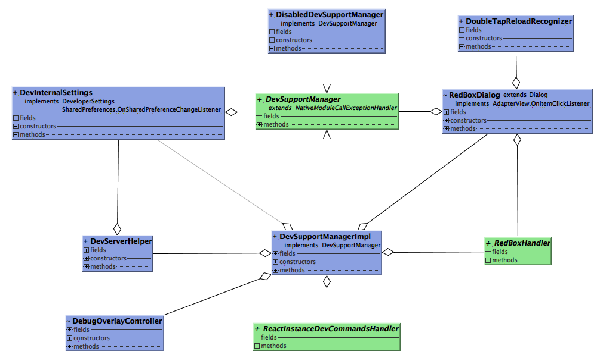
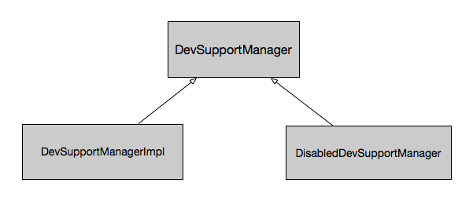

# The Analysis of Debug Mode I


>`Note`:本文基于RNAndroid0.32对Debug模式进行分析。

在RN开发工作中，为了便于开发者调试自己的业务代码，Facebook提供了Debug模式，可以快速地帮助我们捕捉相关信息，为开发工作提供了相当大的便利。通过在`ReactNativeHost`开启Debug开关，即可在开发工作中使用Debug模式。整个Debug框架结构如下：


从类图中可以看到，RN Debug框架的的核心类是`DevSupportManager`，它作为Debug模式的接口可以为RN管理类`ReactInstanceManager`提供开发调试状态下的各项信息和状态。

`DevSupportManager`提供了如下方法：
```java
//展示Java层和JS层的异常
void showNewJavaError(String message, Throwable e);
void showNewJSError(String message, ReadableArray details, int errorCookie);
void updateJSError(final String message, final ReadableArray details, final int errorCookie);
  
//DevOption menu
void addCustomDevOption(String optionName, DevOptionHandler optionHandler);
void setDevSupportEnabled(boolean isDevSupportEnabled);

void hideRedboxDialog();
void showDevOptionsDialog();

boolean getDevSupportEnabled();
DeveloperSettings getDevSettings();
//RIM新创建了ReactContext
void onNewReactContextCreated(ReactContext reactContext);
//销毁ReactContext
void onReactInstanceDestroyed(ReactContext reactContext);
//通过DevServerHelper与Server交互，获取jsbundle文件路径
String getSourceMapUrl();
String getSourceUrl();
String getJSBundleURLForRemoteDebugging();
String getHeapCaptureUploadUrl();
//获取本地缓存的JS文件
String getDownloadedJSBundleFile();

//判断RIM是否应使用缓存中的JS文件来代替asset目录中的文件，
//Debug模式下，本地缓存中有JS文件则会调用此方法
boolean hasUpToDateJSBundleInCache();
//重载开发者的设置选项
void reloadSettings();
//重新加载JS
void handleReloadJS();
//查询packager server状态
void isPackagerRunning(DevServerHelper.PackagerStatusCallback callback);
//获取异常信息
String getLastErrorTitle();
StackFrame[] getLastErrorStack();
```

该接口有两个实现类：`DevSupportManagerImpl`和`DisabledDevSupportManager`：


在Debug模式下，RN使用了`DevSupportManagerImpl`，而在release下，则会使用`DisabledDevSupportManager`。
其中，`DevSupportManagerImpl`为开发者调试程序提供如下功能：
- 通过RedBox显示JS code错误
- 显示Debug menu（用于重新加载JS文件，调试JS代码）
- 与Server交互，更新JSBundle
- 控制重载JSBundle的广播接收器
- 控制识别motion sensor的监听（摇动手机唤起Debug Menu）
- 启动developers settings 视图


##I.  `DevSupportManager`的构造和初始化

### 1.1 构造
在RN运行时环境的启动过程中，RIM利用工厂模式在其实现类`XReactInstanceManagerImpl`的构造函数中，创建了`DevSupportManager`：

```java
  public static DevSupportManager create(
    Context applicationContext,
    ReactInstanceDevCommandsHandler reactInstanceCommandsHandler,
    @Nullable String packagerPathForJSBundleName,
    boolean enableOnCreate,
    @Nullable RedBoxHandler redBoxHandler) {
    if (!enableOnCreate) {//生产环境
      return new DisabledDevSupportManager();
    }
    try {     
      String className =
        new StringBuilder(DEVSUPPORT_IMPL_PACKAGE)
          .append(".")
          .append(DEVSUPPORT_IMPL_CLASS)
          .toString();
      Class<?> devSupportManagerClass =
        Class.forName(className);
      Constructor constructor =
        devSupportManagerClass.getConstructor(
          Context.class,
          ReactInstanceDevCommandsHandler.class,
          String.class,
          boolean.class,
          RedBoxHandler.class);
      return (DevSupportManager) constructor.newInstance(
        applicationContext,
        reactInstanceCommandsHandler,
        packagerPathForJSBundleName,
        true,
        redBoxHandler);
    } catch (Exception e) {
      throw new RuntimeException(
        "Requested enabled DevSupportManager, but DevSupportManagerImpl class was not found" +
          " or could not be created",
        e);
    }
  }
```
当未开启Debug模式时，返回了`DisabledDevSupportManager`对象，否则通过反射创建`DevSupportManagerImpl`对象。

###1.2 初始化
在`DevSupportManagerImpl`的构造方法中，`DevSupportManager`对自身以及所依赖的类对象进行了初始化工作：
```java
public DevSupportManagerImpl(
      Context applicationContext,//Android Context
      ReactInstanceDevCommandsHandler reactInstanceCommandsHandler,//该接口用于基于开发者设定的选项处理重建RN实例请求
      @Nullable String packagerPathForJSBundleName,
      boolean enableOnCreate,
      @Nullable RedBoxHandler redBoxHandler) {//RedBoxHandler创建时为null

	//用于处理DevSupportManager重新创建React Instance的请求
    mReactInstanceCommandsHandler = reactInstanceCommandsHandler;
    //Android Application
    mApplicationContext = applicationContext;
    //RN主module名称,用于从Package server获取JSbundle
    mJSAppBundleName = packagerPathForJSBundleName;
    //Dev setting的helper类，用于获取开发者的settings
    //这些settings都作为SharedPreference存于本地
    mDevSettings = new DevInternalSettings(applicationContext, this);
    //Debug server的helper类
    mDevServerHelper = new DevServerHelper(
        mDevSettings,
        new DevServerHelper.PackagerCommandListener() {
          @Override
          public void onReload() {
            UiThreadUtil.runOnUiThread(new Runnable() {
              @Override
              public void run() {
                handleReloadJS();
              }
            });
          }
        });

    // Prepare shake gesture detector (will be started/stopped from #reload)
    mShakeDetector = new ShakeDetector(new ShakeDetector.ShakeListener() {
      @Override
      public void onShake() {
        showDevOptionsDialog();
      }
    });

    // Prepare reload APP broadcast receiver (will be registered/unregistered from #reload)
    mReloadAppBroadcastReceiver = new BroadcastReceiver() {
      @Override
      public void onReceive(Context context, Intent intent) {
        String action = intent.getAction();
        if (DevServerHelper.getReloadAppAction(context).equals(action)) {
          if (intent.getBooleanExtra(DevServerHelper.RELOAD_APP_EXTRA_JS_PROXY, false)) {
            mDevSettings.setRemoteJSDebugEnabled(true);
            mDevServerHelper.launchJSDevtools();
          } else {
            mDevSettings.setRemoteJSDebugEnabled(false);
          }
          handleReloadJS();
        }
      }
    };

    //从package server拉取的JSBundle文件被临时存放为"ReactNativeDevBundle.js"
    mJSBundleTempFile = new File(applicationContext.getFilesDir(), JS_BUNDLE_FILE_NAME);

    mDefaultNativeModuleCallExceptionHandler = new DefaultNativeModuleCallExceptionHandler();

    setDevSupportEnabled(enableOnCreate);

    mRedBoxHandler = redBoxHandler;//默认为Null
  }
```
在构造方法中，`DevSupportManagerImpl`通过`setDevSupportEnabled`方法进一步调用了`reload`方法，通过各项debug配置进行进一步的初始化操作：
```java
private void reload() {
    // reload settings, show/hide debug overlay if required & start/stop shake detector
    if (mIsDevSupportEnabled) {
      // update visibility of FPS debug overlay depending on the settings
      if (mDebugOverlayController != null) {
        mDebugOverlayController.setFpsDebugViewVisible(mDevSettings.isFpsDebugEnabled());
      }

      // start shake gesture detector
      if (!mIsShakeDetectorStarted) {
        mShakeDetector.start(
            (SensorManager) mApplicationContext.getSystemService(Context.SENSOR_SERVICE));
        mIsShakeDetectorStarted = true;
      }

      // register reload app broadcast receiver
      if (!mIsReceiverRegistered) {
        IntentFilter filter = new IntentFilter();
        filter.addAction(DevServerHelper.getReloadAppAction(mApplicationContext));
        mApplicationContext.registerReceiver(mReloadAppBroadcastReceiver, filter);
        mIsReceiverRegistered = true;
      }

      if (mDevSettings.isReloadOnJSChangeEnabled()) {
        mDevServerHelper.startPollingOnChangeEndpoint(
            new DevServerHelper.OnServerContentChangeListener() {
          @Override
          public void onServerContentChanged() {
            handleReloadJS();
          }
        });
      } else {
        mDevServerHelper.stopPollingOnChangeEndpoint();
      }
    } else {
      // hide FPS debug overlay
      if (mDebugOverlayController != null) {
        mDebugOverlayController.setFpsDebugViewVisible(false);
      }

      // stop shake gesture detector
      if (mIsShakeDetectorStarted) {
        mShakeDetector.stop();
        mIsShakeDetectorStarted = false;
      }

      // unregister app reload broadcast receiver
      if (mIsReceiverRegistered) {
        mApplicationContext.unregisterReceiver(mReloadAppBroadcastReceiver);
        mIsReceiverRegistered = false;
      }

      // hide redbox dialog
      if (mRedBoxDialog != null) {
        mRedBoxDialog.dismiss();
      }

      // hide dev options dialog
      if (mDevOptionsDialog != null) {
        mDevOptionsDialog.dismiss();
      }

      mDevServerHelper.stopPollingOnChangeEndpoint();
   }
}
```

----------
