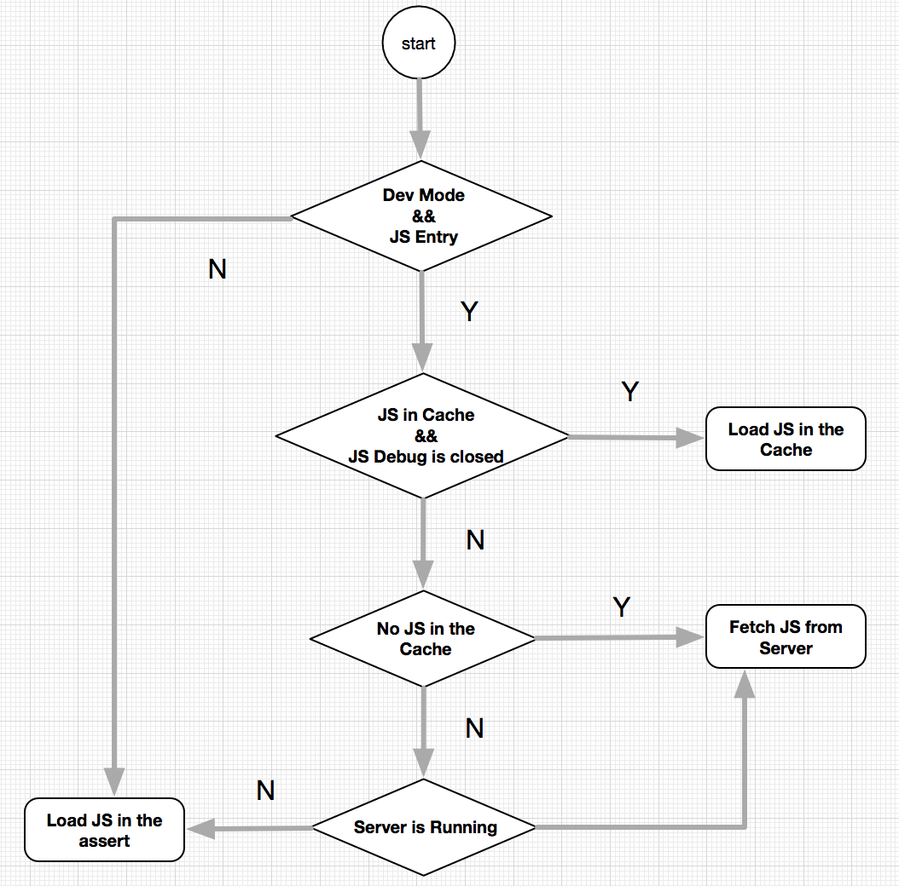

# The Analysis of Debug Mode II
>`Note`:本文基于RNAndroid0.32对Debug模式进行分析。
## 2. JSBundle获取

在RN上下文环境的创建过程中，RIM会在`recreateReactContextInBackgroundInner`方法中，根据开发者的设置来判断从何处加载JSbundle（本地asset，package server，cache）：



###2.1 JSBundle Cache
如果开发者开启了Debug模式并设置了入口module的路径，RIM首先会调用方法`hasUpToDateJSBundleInCache`判断本地是否缓存有最新拉取到的的JS文件：
```java
public boolean hasUpToDateJSBundleInCache() {
    if (mIsDevSupportEnabled && mJSBundleTempFile.exists()) {
      try {
        String packageName = mApplicationContext.getPackageName();
        PackageInfo thisPackage = mApplicationContext.getPackageManager()
            .getPackageInfo(packageName, 0);
        if (mJSBundleTempFile.lastModified() > thisPackage.lastUpdateTime) {//lastUpdateTime是指最近一次App安装时间
          return true;
        }
    } 
}
return false;
```
如果cache中的JS文件的修改时间较当前app最近一次安装时间更新（也就是说，App安装后从Server拉取过JS文件）。如果是第一次安装App，通常情况下cache中是没有临时的JSBundle文件的，需要从Package服务器打包拉取:

```java
//cache中有最新的JSbundle,且未开启JS远程Debug
if (mDevSupportManager.hasUpToDateJSBundleInCache() &&!devSettings.isRemoteJSDebugEnabled()) {
      onJSBundleLoadedFromServer();
}
```
在`onJSBundleLoadedFromServer`方法中调用创建`ReactContext`的方法，与加载本地JSBundle不同，这里创建的`JSBundleLoader`将从package Server拉取JS，但此时不会立即从server中拉取JS，而是采用cahe中的JS文件创建`ReactContext`:
```java
private void onJSBundleLoadedFromServer() {
    recreateReactContextInBackground(
        new JSCJavaScriptExecutor.Factory(mJSCConfig.getConfigMap()),
        JSBundleLoader.createCachedBundleFromNetworkLoader(
            mDevSupportManager.getSourceUrl(),
            mDevSupportManager.getDownloadedJSBundleFile()));
}
```
创建`JSBundleLoader`时，需要传入package Server上JSBundle的路径`SourceUrl`和本地cache中JSBundle的路径：
```java
public static JSBundleLoader createCachedBundleFromNetworkLoader(
      final String sourceURL,
      final String cachedFileLocation) {
    return new JSBundleLoader() {
      @Override
      public void loadScript(CatalystInstanceImpl instance) {
        instance.loadScriptFromFile(cachedFileLocation, sourceURL);
      }

      @Override
      public String getSourceUrl() {
        return sourceURL;
      }
    };
}
```
前面提到的`DevServerHelper`根据主module的文件名（index.android）提供了相应的URL，而本地Cache中JSBundle的路径则是它自身的绝对路径。
###2.2 JSbundle Server
如果是第一次安装App，通常情况下cache中是没有临时的JSBundle文件的，需要从服务器打包拉取JS到本地：
```java
else if (mBundleLoader == null) {
        mDevSupportManager.handleReloadJS();
} 
```
这时候要在客户端显示一些交互界面提示开发者：
```java
public void handleReloadJS() {
    UiThreadUtil.assertOnUiThread();

// 清除redbox
    if (mRedBoxDialog != null) {
      mRedBoxDialog.dismiss();
    }
// 弹出正在拉取JS的dialog
    AlertDialog dialog = new AlertDialog.Builder(mApplicationContext)
      .setTitle(R.string.catalyst_jsload_title)
      .setMessage(mApplicationContext.getString(
          mDevSettings.isRemoteJSDebugEnabled() ? R.string.catalyst_remotedbg_message : R.string.catalyst_jsload_message))
      .create();
    dialog.getWindow().setType(WindowManager.LayoutParams.TYPE_SYSTEM_ALERT);
    dialog.show();
//判断是否开启了JS远程调试功能
    if (mDevSettings.isRemoteJSDebugEnabled()) {
      reloadJSInProxyMode(dialog);
    } else {//拉取JS文件
      reloadJSFromServer(dialog);
    }
  }
```
在`reloadJSFromServer`方法中，`DevManager`通过调用`DevServerHelper`的`downloadBundleFromURL`方法来拉取JS文件。
###2.3 服务器运行状态
`DevManager`在创建ReactContext时候会查询package server的状态，如果server挂掉了，则从本地目录中加载JS，否则从server端拉取JS文件：
```java
mDevSupportManager.isPackagerRunning(//判断当前server运行状态
            new DevServerHelper.PackagerStatusCallback() {
              @Override
              public void onPackagerStatusFetched(final boolean packagerIsRunning) {
                UiThreadUtil.runOnUiThread(
                    new Runnable() {
                      @Override
                      public void run() {
                        if (packagerIsRunning) {
                          mDevSupportManager.handleReloadJS();
                        } else {
                          // If dev server is down, disable the remote JS debugging.
                          //server 挂了，关闭远程调试JS功能，从本地加载JS
                          devSettings.setRemoteJSDebugEnabled(false);
                          recreateReactContextInBackgroundFromBundleLoader();
                        }
                      }
                    });
              }
            });
```
在非开发者模式下，RIM则会从asset目录中加载App中预置的JSBundle文件。


----------
##3. 异常处理
`DevelopSupportManager`继承于`NativeModuleCallExceptionHandler`，当程序发生错误或异常时要触发一系列的处理逻辑，例如打印日志，显示我们熟悉的redbox来提示开发者。`NativeModuleCallExceptionHandler`接口主要负责处理JS调用Native模块时所发生的异常，它有一个回调方法`handleException`，在`DevSupportManagerImpl`中实现如下：
```java
public void handleException(Exception e) {
    if (mIsDevSupportEnabled) {
      if (e instanceof JSException) {
        // TODO #11638796: convert the stack into something useful
        showNewError(e.getMessage() + "\n\n" + ((JSException) e).getStack(), new StackFrame[] {},
                     JSEXCEPTION_ERROR_COOKIE, ErrorType.JS);
      } else {
        showNewJavaError(e.getMessage(), e);
      }
    } else {
      mDefaultNativeModuleCallExceptionHandler.handleException(e);
    }
  }
```
Debug模式下，`DevSupportManagerImpl`最终会调用`showNewError`方法来处理异常：
```java
private void showNewError(
      final String message,
      final StackFrame[] stack,
      final int errorCookie,
      final ErrorType errorType) {
    UiThreadUtil.runOnUiThread(
        new Runnable() {
          @Override
          public void run() {
            if (mRedBoxDialog == null) {
              mRedBoxDialog = new RedBoxDialog(mApplicationContext, DevSupportManagerImpl.this, mRedBoxHandler);
              mRedBoxDialog.getWindow().setType(WindowManager.LayoutParams.TYPE_SYSTEM_ALERT);
            }
            if (mRedBoxDialog.isShowing()) {
              // Sometimes errors cause multiple errors to be thrown in JS in quick succession. Only
              // show the first and most actionable one.
              return;
            }
            mRedBoxDialog.setExceptionDetails(message, stack);
            updateLastErrorInfo(message, stack, errorCookie, errorType);
            // Only report native errors here. JS errors are reported
            // inside {@link #updateJSError} after source mapping.
            if (mRedBoxHandler != null && errorType == ErrorType.NATIVE) {
              mRedBoxHandler.handleRedbox(message, stack, RedBoxHandler.ErrorType.NATIVE);
              mRedBoxDialog.resetReporting(true);
            } else {
              mRedBoxDialog.resetReporting(false);
            }
            mRedBoxDialog.show();
          }
        });
  }
```
前面介绍了debug模式下`DevSupportManagerImpl`如何处理JS调用Native模块引发的异常，那么异常通常会在哪些地方抛出呢？主要分布于以下几个部分。

###3.1 Exceptions in `XReactInstanceManagerImpl`
`XReactInstanceManagerImpl`通过异步任务对RN上下文环境ReactContext进行创建，在异步任务在后台线程中执行完毕后，在UI线程中通过调用`setupReactContext`方法进行收尾工作（该方法具体分析见RN框架启动源码分析）。`XReactInstanceManagerImpl`对该方法中可能产生的异常进行了捕获，并交给相应的`NativeModuleCallExceptionHandler`进行处理（Debug和release不同）。

### 3.2 CatalystInstanceImpl异常
在RN框架启动源码分析中我们提到过，`CatalystInstanceImpl`管理了三个消息线程，这些消息队列线程主要负责JS与Native之间的互相调用。对于调用期间发生的异常，`CatalystInstanceImpl`通过`NativeExceptionHandler`进行处理。关于消息队列中的逻辑在以后进行具体分析。

### 3.3 ReactContext异常
`ReactContext`负责为native端模块和组件提供运行环境，`ReactNative`定义了很多`AsyncTask`来完成这些模块和组件（例如网络，存储，camera，图片等）中所需要进行的异步操作。这些异步操作根据是否返回结果可以分为两类：`GuardedAsyncTask`和`GuardedResultAsyncTask`。
另外，`ReactNative`在实现过程中也利用了Android的`Choreographer`机制来实现界面绘制的调度。Facebook定义了异步任务`GuardedChoreographerFrameCallback`用来进行绘制过程中的异步回调操作。
关于上述这些异步任务执行中所产生的异常，都会交给`ReactContext`所依赖的`NativeExceptionHandler`进行处理。
