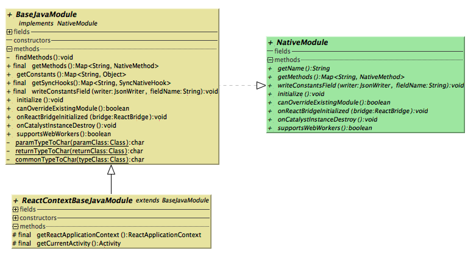

#The Analysis of ReactNative Module


>`Note`:本文基于RNAndroid 0.32 对Debug模式进行分析。

##Overview
`组件化`是ReactNative框架中一个重要的设计思想。通过`ReactContextBaseJavaModule`、`BaseJavaModule`、`NativeModule`，`JavaScriptModule`，	`ViewManager`，`ReactPackage`等一系列基类与接口，RN为组件和模块制订了实现规则，保证各个模块组件无缝接入的同时，也提高了框架的扩展性。
在ReactNative框架中，Native和JS层之间可以通过互相调用对方定义的接口来实现互相通信。除了自定义接口，我们也可以将一些Native组件封装起来提供给JS端调用。本文将介绍RN如何通过这些接口和基类完成本地服务和接口的组件化。

----------

##ReactPackage
ReactNative框架提供了接口`ReactPackage`对接口模块和自定义组件进行封装，该接口需要维护三个List：
>- `List<NativeModule>`:Native端提供给JS端的接口模块
>- `List<JavaScriptModule>`：JS端提供给Native端的接口模块
>- `List<ViewManager>`：Native提供给JS端调用的组件

在框架启动过程中，`ReactPackage`会将各个模块和组件交给RIM集中处理，具体过程在《框架启动过程分析》中介绍。

###NativeModule
在RN框架中，本地模块封装了向JS提供的接口服务，而`NativeModule`接口的Java实现类都要继承`BaseJavaModule`和`ReactContextBaseJavaModule`，三者的继承关系如下:


在`NativeModule`接口中，需要被实现的方法如下：
> - `getName` : 返回该模块的名称，JS端在使用require()函数获取该模块的时候会使用这个名称。
> - `getMethods` ： 返回该模块提供给JS调用的方法集合`Map<String, NativeMethod>`。
> - `initialize` ：在RN框架启动时，当`CatalystInstance`创建完毕后，则会调用该方法对模块进行初始化。
> - `writeConstantsField` ：该方法负责向JS端传递该模块所暴露的常量。
> - `canOverrideExistingModule` ：是否允许该模块去覆盖已经注册过的模块。
> - `onReactBridgeInitialized` ：该方法会在`ReactBridge`创建完毕后在JS线程中调用，在JS bundle加载之前所需的操作可以放在这里执行。
> - `onCatalystInstanceDestroy` ：`CatalystInstance`销毁前回调。
> - `supportsWebWorkers`： 表示该模块是否支持web workers

除了上述方法，`NativeModule`中还定义了两个接口：
> - `NativeMethod` ： 提供给JS调用的方法
> - `SyncNativeHook` ：提供给JS调用的同步方法

通过`NativeModule`接口，RN框架相当于为开发者根据自身需求自定义模块制订了规则，开发者只需要遵守这些规则就可以保证自己的组件在框架中正常运行。为了进一步给开发者提供便利，RN提供了`BaseJavaModule`和`ReactContextBaseJavaModule`这两个抽象类，里面提供了`NativeModule`接口的一些默认实现。两者的区别在于，一些模块的调用可能需要用到RN的上下文环境，`ReactContextBaseJavaModule`提供了`ReactApplicationContext`和当前业务的页面activity。下面我们以抽象类`BaseJavaModule`为例对上述接口的实现进行分析。

###BaseJavaModule
在Android端进行过ReactNative开发的同学都知道，如果我们希望在Native Module中实现某个方法，并将该方法暴露给JS端调用，只需要在该方法上加注解`@ReactMethod`即可，十分方便。
其实还有另外一个注解`@ReactSyncHook`用于标识暴露个JS端调用的同步方法，两者不同之处在于：`@ReactMethod`所注解的方法调用时采用异步的方式执行，而`@ReactSyncHook`调用的方法则会采用同步的方式来执行方法。同步的方式虽然也可以在JS端进行调用，同时也可以返还执行结果，但是这种方式有很强的性能要求，并有可能引发线程相关的bug。因此，绝大多数场景下还是会指定接口方法的执行方式为异步调用。

那么，BaseJavaModule内部是如何实现方法的管理呢？
首先，BaseJavaModule维护了两个提供给JS调用的方法集合，分别是异步方法和同步方法：
```java
 private @Nullable Map<String, NativeMethod> mMethods;
 private @Nullable Map<String, SyncNativeHook> mHooks;
  @Override
public final Map<String, NativeMethod> getMethods() {
    findMethods();
    return mMethods;
}
public final Map<String, SyncNativeHook> getSyncHooks() {
    findMethods();
    return mHooks;
}
```
我们来看一下BaseJavaModule具体是如何实现`findMethods`，分析在注释中：
```java
  private void findMethods() {
    if (mMethods == null) {
      mMethods = new HashMap<>();
      mHooks = new HashMap<>();

      Method[] targetMethods = getClass().getDeclaredMethods();
      
      for (Method targetMethod : targetMethods) {
        if (targetMethod.getAnnotation(ReactMethod.class) != null) {
          String methodName = targetMethod.getName();
          mMethods.put(methodName, new JavaMethod(targetMethod));
        }
        if (targetMethod.getAnnotation(ReactSyncHook.class) != null) {
          String methodName = targetMethod.getName();
          mHooks.put(methodName, new SyncJavaHook(targetMethod));
        }
      }
    }
  }
```
首先通过反射获取到module中所有的public方法，遍历所有public方法并找出被ReactMethod和ReactSyncHook注解的方法加入集合中。
这两个集合中值的类型分别是`NativeMethod`和`SyncNativeHook`，也是就是我们在`NativeModule`中的那两个接口，在`BaseJavaModule`中的具体实现为`JavaMethod`和`SyncJavaHook`。
####JavaMethod
`JavaMethod`类描述了提供给JS端调用的异步方法，其构造方法如下：
```java
public JavaMethod(Method method) {
      mMethod = method;//传入的method对象
      Class[] parameterTypes = method.getParameterTypes();//获取该方法所有的参数类型的Class对象
      mArgumentExtractors = buildArgumentExtractors(parameterTypes);//通过参数类型建立相应的参数提取器
      mSignature = buildSignature(parameterTypes);//生成该对象的唯一标识
	//由于Native方法在一个独立的消息队列线程中被调用，因此为每个方法分配一个object数组来存放参数可以每次调用该方法时复用，节省内存
      mArguments = new Object[parameterTypes.length];
      mJSArgumentsNeeded = calculateJSArgumentsNeeded();
      mTraceName = BaseJavaModule.this.getName() + "." + mMethod.getName();
    }
```
首先构造方法会根据传入的method对象来获取到所有的参数类型的Class对象，然后根据参数类型的class对象创建该参数的提取器`ArgumentExtractor`：
```java
private ArgumentExtractor[] buildArgumentExtractors(Class[] paramTypes) {
...
      int executorTokenOffset = 0;

      ArgumentExtractor[] argumentExtractors = new ArgumentExtractor[paramTypes.length - executorTokenOffset];
      for (int i = 0; i < paramTypes.length - executorTokenOffset; i += argumentExtractors[i].getJSArgumentsNeeded()) {
        int paramIndex = i + executorTokenOffset;
        Class argumentClass = paramTypes[paramIndex];
        if (argumentClass == Boolean.class || argumentClass == boolean.class) {
          argumentExtractors[i] = ARGUMENT_EXTRACTOR_BOOLEAN;
        } else if (argumentClass == Integer.class || argumentClass == int.class) {
          argumentExtractors[i] = ARGUMENT_EXTRACTOR_INTEGER;
        } else if (argumentClass == Double.class || argumentClass == double.class) {
          argumentExtractors[i] = ARGUMENT_EXTRACTOR_DOUBLE;
        } else if (argumentClass == Float.class || argumentClass == float.class) {
          argumentExtractors[i] = ARGUMENT_EXTRACTOR_FLOAT;
        } else if (argumentClass == String.class) {
          argumentExtractors[i] = ARGUMENT_EXTRACTOR_STRING;
        } else if (argumentClass == Callback.class) {
          argumentExtractors[i] = ARGUMENT_EXTRACTOR_CALLBACK;
        } else if (argumentClass == Promise.class) {
          argumentExtractors[i] = ARGUMENT_EXTRACTOR_PROMISE;
          Assertions.assertCondition(
              paramIndex == paramTypes.length - 1, "Promise must be used as last parameter only");
          mType = METHOD_TYPE_REMOTE_ASYNC;
        } else if (argumentClass == ReadableMap.class) {
          argumentExtractors[i] = ARGUMENT_EXTRACTOR_MAP;
        } else if (argumentClass == ReadableArray.class) {
          argumentExtractors[i] = ARGUMENT_EXTRACTOR_ARRAY;
        } else {
          throw new RuntimeException(
              "Got unknown argument class: " + argumentClass.getSimpleName());
        }
      }
      return argumentExtractors;
    }
```
`ArgumentExtractor`是`JavaMethod`的静态内部类，主要负责根据参数类型从C层提取出JS端传递过来的参数：
```java
private static abstract class ArgumentExtractor<T> {
    public int getJSArgumentsNeeded() {
      return 1;
    }

    public abstract @Nullable T extractArgument(
        CatalystInstance catalystInstance, ExecutorToken executorToken, ReadableNativeArray jsArguments, int atIndex);
}
```
该类的具体实现与具体的参数类型相关，以Boolean类型为例:
```java
static final private ArgumentExtractor<Boolean> ARGUMENT_EXTRACTOR_BOOLEAN =
      new ArgumentExtractor<Boolean>() {
        @Override
        public Boolean extractArgument(
            CatalystInstance catalystInstance, ExecutorToken executorToken, ReadableNativeArray jsArguments, int atIndex) {
          return jsArguments.getBoolean(atIndex);
        }
};
```
在`JavaMethod`的构造方法中，还通过方法参数类型生成了标识该对象的签名：
```java
private String buildSignature(Class[] paramTypes) {
      StringBuilder builder = new StringBuilder(paramTypes.length);
      builder.append("v.");
      for (int i = 0; i < paramTypes.length; i++) {
        Class paramClass = paramTypes[i];
        if (paramClass == ExecutorToken.class) {
				.....
        } else if (paramClass == Promise.class) {
          //使用Promise的方法被标识为异步调用
          mType = METHOD_TYPE_REMOTE_ASYNC;
        }
        //把参数类型转换为对应的字母标识
        builder.append(paramTypeToChar(paramClass));
      }
	    .....
      return builder.toString();
    }
```
`SyncJavaHook`的创建与`JavaMethod`基本相同，只是代表的方法调用方式不同而已，这里不再赘述。
上文提到，`JavaMethod`是接口`NativeMethod`的实现类，接口方法有两个：
> - `getType`：返回该方法的类型，`METHOD_TYPE_REMOTE`表示该方法是一个普通方法，`METHOD_TYPE_REMOTE_ASYNC`表示该方法返回一个`promise`对象给调用者。
>  - `invoke` ：当JS调用`JavaMethod`时执行的操作，具体实现如下：
```java
@Override
public void invoke(CatalystInstance catalystInstance, ExecutorToken executorToken, ReadableNativeArray parameters) {
      try {
        int i = 0, jsArgumentsConsumed = 0;
        int executorTokenOffset = 0;
        try {
          for (; i < mArgumentExtractors.length; i++) {
            mArguments[i + executorTokenOffset] = mArgumentExtractors[i].extractArgument(
                catalystInstance, executorToken, parameters, jsArgumentsConsumed);
            jsArgumentsConsumed += mArgumentExtractors[i].getJSArgumentsNeeded();
          }
        } catch (UnexpectedNativeTypeException e) {
				....
        }

          mMethod.invoke(BaseJavaModule.this, mArguments);
		.....
    }
```
在`invoke`方法中，`JavaMethod`首先利用之前在构造函数中初始化完毕的参数提取器`ArgumentExtractor`从JS端传递过来的参数数组`ReadableNativeArray`中提取出参数，随后通过反射来完成Native模块中的方法的调用。

----------
###JavaScriptModule
`JavaScriptModule`接口封装了JS模块负责向Native端提供接口服务，它的具体实现当然是在JS端完成。那么在Native端，该接口存在的意义是什么呢？
`JavaScriptModule`在Native端起到一个标记的作用，表示在JS层有一个相同名字的模块，提供了接口中声明的方法给Native层调用。通过`CatalystInstance`的`getJSModule`方法可以对该模块中同名方法进行调用。

